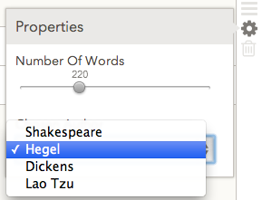

 [**Beginning Versal gadget development**](#beginning-versal-gadget-development)<br/>
...... [API references](#api-references)<br/>
...... [Prerequisites](#prerequisites)<br/>
...... [Overview and concepts](#overview-and-concepts)<br/>
............ [How gadgets work](#how-gadgets-work)<br/>
............ [Conceptual example: a "word gallery" gadget](#conceptual-example-a-"word-gallery"-gadget)<br/>
...... [Installing the Versal SDK](#installing-the-versal-sdk)<br/>
...... [Testing the hello-world gadget](#testing-the-hello-world-gadget)<br/>
...... [Other sample gadgets](#other-sample-gadgets)<br/>
............ [hello-world gadget](#hello-world-gadget)<br/>
............ [highlighter gadget](#highlighter-gadget)<br/>
............ [challenge gadget](#challenge-gadget)<br/>
............ [educreations embedding gadget](#educreations-embedding-gadget)<br/>
 [**Deploying a gadget**](#deploying-a-gadget)<br/>
...... [Testing locally](#testing-locally)<br/>
...... [Deploying in sandbox](#deploying-in-sandbox)<br/>
...... [Inserting a gadget into a course](#inserting-a-gadget-into-a-course)<br/>
...... [Updating a published gadget](#updating-a-published-gadget)<br/>
 [**The layout of a gadget project**](#the-layout-of-a-gadget-project)<br/>
 [**The gadget lifecycle**](#the-gadget-lifecycle)<br/>
...... [Gadget/player messaging](#gadgetplayer-messaging)<br/>
...... [Gadget configuration](#gadget-configuration)<br/>
...... [Attached / Detached](#attached--detached)<br/>
...... [Initial visual state](#initial-visual-state)<br/>
...... [Persisting the attributes and the learner state](#persisting-the-attributes-and-the-learner-state)<br/>
...... [Assets](#assets)<br/>
...... [Challenges and scoring](#challenges-and-scoring)<br/>

# Beginning Versal gadget development

## API references

* [Gadget messaging API specification](https://github.com/Versal/gadget-api-spec)
* [Versal SDK repository](https://github.com/Versal/sdk)

## Prerequisites

* Working knowledge of JavaScript, HTML5, CSS
* Web development / debugging tools, such as Chrome dev tools
* Basic knowledge of the Unix command line

Optional, but nice-to-have knowledge

* Version control (e.g. `git`)
* Preprocessors (e.g. `coffeescript`, `stylus`)
* Build tools (e.g. `grunt`, `gulp`, `make`)
* Testing (e.g. `mocha`, `jasmine`, `Karma`)
* Module loaders (e.g. `RequireJS`, `browserify`)

## Overview and concepts

A course in the Versal platform consists of lessons. Each lesson can have all kinds of content - from text, images, and videos, to rich interactive elements. In a Versal lesson, all these elements of content are shown by pieces of HTML/JS code, called **gadgets**.

Some gadgets are very simple - just showing a paragraph of text or an image. Other gadgets may show interactive graphics or present a quiz to the learner (and score it right away). Because gadgets are custom programmed, there is no limit to what you can do as a gadget developer. You can load any JS libraries and frameworks, communicate with any third-party Web servers, and use the Versal platform services to access image assets and other persistent data.

The Versal platform provides a **course player**, which is simultaneously a learning environment and a course authoring environment. So most gadgets -- certainly all nontrivial gadgets -- need to enable in-place configuration by course authors (this is known as **gadget editing**). The appearance and interactive functionality during gadget editing must be provided on top of the gadget's regular learner's UX. Versal is a strong supporter of [Bret Victor](http://worrydream.com/)’s ideas, and we highly recommend that you watch his [classic video](http://vimeo.com/36579366) before starting your first gadget.

### How gadgets work

A gadget is an HTML document that lives inside an `iframe`. The `iframe` for each gadget will be created automatically by the Versal player whenever a lesson document is opened by either a course author or a learner.

The gadget communicates with the Versal player through the `postMessage` API, which passes serialized JSON data. Gadgets use this API to perform four basic functions:

* get and set persistent configuration data (created by the course author) and learner-specific data (for the current learner)
* obtain assets (images, videos) uploaded by the course author and stored on the Versal platform
* store question/answer data and perform scoring (for quizzes and other challenges)
* use some predefined visual features of the Versal player ("empty gadget" views, the "property sheets", etc.)

This repository includes a basic "Hello, World!" gadget for you to get started. Inside the `hello-world-gadget` directory, you can just open [index.html](./hello-world-gadget/index.html) to see the gadget as viewed by a learner. The code in [main.js](./hello-world-gadget/main.js) demonstrates how to use property sheets, the configuration data, and the learner-specific data.

Further sample gadgets are available in the repositories [Versal/highlightr-iframe](https://github.com/Versal/highlightr-iframe), [Versal/challenges-gadgets](https://github.com/Versal/challenges-gadgets), and [Versal/highlightr-iframe](https://github.com/Versal/highlightr-iframe).

### Conceptual example: a "word gallery" gadget

Imagine a gadget for learning French words. The gadget shows a gallery of images and the corresponding words. The learner can look at the words and the images one by one, passing to the next or to the previous word.

The course author will select the images and the words and put them into a certain sequence. A learner can sign in to Versal.com from any computer and will always see the word last selected during their most recent session.

The gadget code needs to provide a UI for the course author as well as for the learners. The Versal platform takes care of persistently storing the gadget configuration data and the image or video assets. The platform also tracks each user's individual selections as the learners interact with the gadget.

## Installing the Versal SDK

To begin developing gadgets, you will need:
- Linux, Mac OS X, or Windows
- [git](http://git-scm.com/book/en/Getting-Started-Installing-Git)
- [node/npm](http://nodejs.org/)  You need `node` version 0.10.21 or newer.
- a [Versal.com](http://versal.com) account

To install `git` and `npm` under Mac OS X:

    brew install git
    brew install npm

To install `git` and `npm` under a recent Ubuntu Linux:

    sudo apt-get install --yes git npm curl nodejs-legacy

To install `git` and `npm` under MS Windows:

* Install `git` by downloading and running the EXE installer from [msysgit.github.com](http://msysgit.github.com)
* Install `npm` and `node` from [nodejs.org](http://nodejs.org/download/) by downloading and running the MSI installer
* You need `zip`, for example from the [gnuwin32](http://downloads.sourceforge.net/gnuwin32/zip-3.0-setup.exe) project
* Start "Git Bash" from the menu; this gives a more Unix-like environment for command-line usage.
* Copy `zip` executables to the Bash path, for example: `cp /c/Program\ Files/GnuWin32/bin/* /usr/bin/`

Once you have `npm`, you can install the Versal SDK:

    npm install -g versal-sdk

(If this gives a permission error on your system, run `sudo npm install -g versal-sdk`. However, it is better to avoid using `sudo` for `npm`, if it is possible on your system.)

This installs the system-wide command `versal`. With this command, you can test your gadgets and publish them on the Versal platform.

To check that the Versal SDK has been installed, run the command `versal -v`. This should print the version (0.5.0 or higher).

## Testing the hello-world gadget

To verify that your installation works, let's test a sample gadget. This gadget shows a "hello, world" message with a custom word and color inserted by the course author. The learner can click on this word and toggle the italics and boldface font on the message. The gadget also displays an image uploaded by the course author.

Clone this repository and move into its directory:

    git clone https://github.com/Versal/gadget-dev-intro.git
    cd gadget-dev-intro/hello-world-gadget

In the `hello-world-gadget` directory, run the command

    versal preview

This will start a local HTTP server on port `3000`. Now open the URL [localhost:3000](http://localhost:3000) in a Web browser. You will see an empty lesson and a test gadget in the gadget tray below. Double-click on that gadget; you will see that the gadget has been added to the lesson.

You have now tested the sample gadget!

The Versal SDK command reference can be found in the [Versal SDK repository](https://github.com/Versal/sdk).

## Other sample gadgets

To get you started, here are some more sample gadget projects for you to examine.

### hello-world gadget

[Versal/gadget-dev-intro](https://github.com/Versal/gadget-dev-intro)

You have just tested it.

- demonstrates property sheets, attributes, learner states, and asset handling
- all messages (sent and received) are logged to console
- the code is commented and uses no frameworks

### highlighter gadget

[Versal/highlightr-iframe](https://github.com/Versal/highlightr-iframe)

- `grunt` with `stylus` and `mocha` support
- provides a reasonable path for testing the gadgets
- provides a `postMessage` wrapper
- the code is commented and uses no no frameworks

To install `grunt`, use the command

    npm install -g grunt-cli

### challenge gadget

[Versal/matching-challenge-example-gadget](https://github.com/Versal/matching-challenge-example-gadget)

- uses the challenge/scoring API
- shows use of a view framework

### educreations embedding gadget

[Versal/educreations-embed-gadget](https://github.com/Versal/educreations-embed-gadget)

- Take the embed code from [educreations.com](http://educreations.com) and make it a gadget
- Backbone.js with Stylus.js for CSS and Handlebars.js for templating

# Deploying a gadget

After you create the HTML and JS files for your gadget, you will want to test your gadget visually and then publish it. The deployment cycle looks like this:

* Test the gadget locally on your development machine
* Deploy the gadget in a "sandbox" on Versal.com
* Create a course that uses your gadget
* Develop, test, and deploy an updated version of the gadget
* Update the gadget in the course(s) using it

## Testing locally

Go to the gadget directory (where `manifest.json` is located) and run the command

```
versal preview
```

This command starts a local HTTP server on port 3000. Open the URL [localhost:3000](http://localhost:3000) in a browser. You will see an empty lesson page and your gadget's icon in the bottom tray. Double-click on the gadget icon to insert the gadget into the lesson. This is how a course author will start using your gadget in a new course. You can now interact with your gadget, both as a course author and as a learner. (Click the "cogwheel" icon to toggle gadget editing.)

Pro tip: While this local HTTP server is running, you can continue changing the gadget's code. Just refresh the browser to see the changes live! (Except if you change `manifest.json` then you need to restart `versal preview` to see the changes.)

## Deploying in sandbox

If you haven't yet deployed your gadget, make sure that you sign in to Versal:

```
versal signin
```

Go to the gadget directory and run the command

```
versal publish
```

The gadget will be published to the Versal platform. However, this gadget is published in a "sandbox". It is not yet approved for the entire world to see, and will be visible only in courses authored by yourself.

*WARNING: Before publishing a new version of a gadget, you should always increment the version of your gadget in `manifest.json` or the Versal platform might serve earlier versions from a cache. In future releases the SDK and/or the Versal platform will programmatically enforce version bumps when publishing.*

## Inserting a gadget into a course

Go to [staging.versal.com](http://staging.versal.com). You will need to authenticate; ask us for details. Sign in to `staging.versal.com` and create a new course. After you start editing the new course, click on the "Sandbox" tray in the bottom; you should see your new gadget available. Drag your gadget into the lesson to start using it.

## Updating a published gadget

To update a published gadget, you need to do two things:

- change the gadget version upwards (e.g. from `0.1.3` to `0.1.4`) in `manifest.json`

- publish the gadget again (`versal publish`)

Suppose you already created some courses that use your gadget version `0.1.3`, and now you published an updated version `0.1.4`. When you do this, the courses do not automatically start using the updated version. To avoid breaking the existing courses, all older gadget versions will be preserved by the platform. The course authors need to agree explicitly to upgrade your gadget to a new version.

Go to the course you created where your gadget has been used. Click on the "Sandbox" tray and you will see that your gadget's icon has a band on it, indicating that an upgrade is available. Click on the band and confirm the upgrade to a new version.

# The layout of a gadget project

The Versal platform provides a **player** environment that loads the gadget in the context of a lesson, passes configuration data to the gadget, and receives learner's data from the gadget.

Presently, a gadget is developed as a Web app - that is, as an individual HTML document. The player will first load the gadget's root file, `index.html`. Any JS libraries or frameworks required by the gadget need to be loaded there by usual mechanisms supported by HTML5 (statically or asynchronously). The gadget's JS code should be loaded and started from this `index.html`, as in any ordinary Web app.

In addition, each gadget must have an icon, `assets/icon.png`, and a `manifest.json` that specifies the gadget's current version, the Versal user who developed it, and other data.

The command

    versal create test1

will create a new minimal gadget project in the subdirectory `test1`. The project will contain just three files, `index.html`, `assets/icon.png`, and `manifest.json`.

The layout of `manifest.json` is clear from this example (see [manifest.json](./hello-world-gadget/manifest.json) ):

```
{
  "name": "hello-world",  // short name of gadget
  "version": "0.1.1",   // semantic version
  "title": "Hello, World",
  "description": "Demo gadget showing the basic API",
  "author": "versal",   // username on Versal.com
  "launcher": "iframe",  // will be phased out in the future, but necessary for now
  "defaultConfig": {  // default set of attributes for the gadget
    "chosenColor" : "#00cc00",
    "chosenWord" : "green"
  },
  "defaultUserState": { // default learner state for the gadget
    "isBold": false
  }
}
```

The command `versal publish` needs to be run in the root of the gadget project directory. It will package _all_ files in the gadget project and upload them to the Versal platform. It is advisable to keep in this project directory only the files that are required for the gadget at run time. Put any other files (for example, source files, documentation, or other data) in some other directory, not under the gadget project directory.

# The gadget lifecycle

## Gadget/player messaging

The player communicates with the gadget through `postMessage`.

To read messages from the Player, your gadget should add a listener to its own `window`:

```
window.addEventListener('message', function(evt) {
  var message = evt.data;
  // process the message...
});
```

To pass messages back to the Player, your gadget should trigger them on its parent, without specifying a target origin:

```
window.parent.postMessage({ foo: 'bar' }, '*');
```

The supported messages and their JSON formats are documented in the repository [Versal/gadget-api-spec](https://github.com/Versal/gadget-api-spec). Here we will describe how gadgets use these messages to communicate with the player.

## Gadget configuration

When the gadget code is first loaded, the gadget is not yet attached to a DOM node in the lesson document. At this point, the gadget should prepare to configure itself. The first messages arriving from the player will give the gadget its latest configuration data.

Keep in mind that the Versal platform expects the same gadget code to enable regular learner UX and the additional editing UX. In future releases, we plan to make it easy to separate the editing and the learner's UX. Then the Versal course player could avoid loading the gadget editing code when presenting a course to a learner, thereby improving performance and reducing bandwidth.

For this reason, the gadget configuration data has two main parts: the gadget's **attributes** and the **learner state**.

The "attributes" are parameters of the gadget as configured by the course author, globally for all learners. The "learner state" describes the particular learner's interaction with the gadget.

For the "word gallery" gadget, the attributes describe the array of words and images, as chosen by the course author. The learner state is the number of the last viewed item.

Each gadget’s learner state is associated with the particular signed-in Versal user (who may or may not have authoring rights to the gadget).
When editing the gadget, the author changes the gadget's attributes, while the learner state properties can only be changed by each learner and only for the particular instance of the gadget instantiated for that individual learner. That learner can be the course author, too, since all authors are learners by virtue of being authenticated Versal users. But other learners cannot change the gadget's attributes.

How does the gadget receive its configuration data? Upon initialization, the gadget should send the message `startListening` to the player. Shortly after loading the gadget's `index.html`, the player will post a series of `attributesChanged` and/or `learnerStateChanged` messages to the gadget. These messages carry the attributes and the learner state for the gadget.

The configuration data always consists of a set of attributes - each attribute being a key-value pair. As an example, the attributes for the "French word gallery" gadget might contain an array, such as

```
{ words:
	[
	   { imageId : "a123fc", word : "soupçon" },
	   { imageId : "4cb834", word : "parapluie" },
	   { imageId : "7ad23c", word : "gants" }
	]
}
```

while the learner state may be just a single attribute, say `{index: 1}`, storing the index of the word last viewed by the learner. As a developer, you are free to organize your data structures as you see fit.

The gadget may also receive a `setEditable` message that indicates whether an author has started editing the gadget.

The gadget code must always react to these messages by adjusting the UI elements and/or storing the values internally. For example, the `setEditable` message can come at any time as the author toggles editing on and off. The same holds for `attributesChanged` and `learnerStateChanged`.

## Attached / Detached

When the gadget has been attached to a DOM element in the lesson, the player posts the message `attached` to the gadget. The gadget may need to refresh its UI at this time.

_After_ the gadget was removed from the lesson DOM, the player posts the `detached` message.

## Initial visual state

At this early stage, when the gadget has not yet been attached to the lesson document, the gadget may also post the messages `setEmpty`, `setHeight`, and `setPropertySheetAttributes` to the player. These messages will configure some visual aspects of the gadget that are provided by the Versal platform.

The `setEmpty` message is relevant when editing; it tells the player to display a gadget placeholder. The author will see right away that the gadget is "empty" and cannot yet show any useful content. For instance, images need to be uploaded, or other content needs to be configured, before the gadget can show anything. Here is how an empty gadget looks:


The `setHeight` message specifies the desired pixel height of the gadget's window. The width of the window is fixed, equal to the total width of the lesson window. (In the Web browser, this is 724 px).

The `setPropertySheetAttributes` message will declare the types and the names of the attributes displayed in the gadget's **property sheet**. This is a simple UI provided by the Versal player, which allows the author to configure some parameters of the gadget.

## Persisting the attributes and the learner state

The gadget can use property sheets for simple attributes such as text, numbers, or checkboxes. The property sheet is toggled through the "cogwheel" icon.

The Versal player will automatically persist all attributes defined on the property sheet. When the author changes any values in the property sheet, the gadget will receive an `attributesChanged` message and can react to it normally.

Property sheets automatically specify titles for the data attributes. The `setPropertySheetAttributes` message specifies all titles and types of the attributes. Presently the player supports the following data types in property sheets:

*	`Text`, `Number`, `TextArea`, `Checkbox`, `Color`: these types need no options.

Example: `{ type: 'TextArea' }`

*   `Checkboxes`, `Radio`, `Select`: these types take an array of `options`, representing the possible selection items. The `Select` type is a drop-down listbox.

Example: `{ type: 'Radio', options : ['Green', 'Yellow', 'Red' ] }`

*      `Date`, a date picker

Example: `{ type: 'Date', yearStart: 1990, yearEnd : 2038 }`

*      `DateTime`, a date/time picker

Example: `{ type: 'Datetime', 'yearStart : 1990, yearEnd : 2038, minsInterval : 60 }`

*      `Range`, a slider with a given range and step

Example: `{ type: 'Range', min: 100, max: 200, step: 10 }`

*      `Tags`, a selection of user-supplied tags

Example:

```
{ type : 'Tags',
  options: ['music', 'movies', 'study', 'family', 'pets'],
  lowercase: true,
  duplicates: false,
  minLength: 3,
  maxLength: 20,
  updateAutoComplete: true
}
```

Here is an example property sheet, showing a slider for a numerical value ("number of words") and a drop-down selection box ("chosen author"):



The property sheet in this screenshot was configured by the following message:

```
{ event : 'setPropertySheetAttributes',
  data: {
     numberOfWords:  { type: 'Range', min: 100, max: 500, step: 20 },
     chosenAuthor: { type: 'Select',
                      options: ['Shakespeare', 'Hegel', 'Dickens', 'Lao Tzu']
                   }
         }
}
```

If the property sheets are not powerful enough for configuring your gadget, you can implement your own custom UI for the gadget editing. Your gadget should post the message `setAttributes` whenever you need to persist some changed attributes.

There is no property sheet option for the learner state. Use the message `setLearnerState` to persist any changes in the user state.

## Assets

If your gadget displays images, the author must somehow provide these images when creating the lesson. The Versal platform allows the author to upload images and videos directly through the **asset** API.

The gadget asks the user to upload a new asset by posting a message like this:

```
{ event: 'requestAsset',
  data: {
  	attribute: 'myImage',
  	type: 'image'
  }
}
```

Possible asset types are `image` and `video`. The `attribute` field specifies the name of the gadget's attribute that will hold the asset information.

Upon a `requestAsset` message, the player displays a UI for uploading an asset. After an upload, the player will post a message `attributeChanged` to the gadget:

```
event: 'attributeChanged',
data: {
 	myImage: {
  		id: 'a73cb21...",
  		representations: [
  			{ id: '65bb32...',
  			  scale: '800x600',
  			  contentType: 'image/png',
  			  original: false,
  			  available: true
  			}, ...
  		]
  	}
}
```

So the attribute named `myImage` will now contain the asset information.

A Versal asset contains an array of `representations`. Each element of that array describes an image or a video, which may have been scaled down to a smaller size. One of the representations is tagged as `original:true`; this is the one that has not been scaled down.  (If you upload a small image, it will not be scaled down, and so there will be only one "representation", which will be `original`.)

All uploaded assets are automatically processed (and scaled down if necessary) by the Versal platform. The resulting representations are stored in remote URLs. To display the image, you need to fetch the URL that corresponds to the representation's ID. You post a message `getPath`:

```
{ event: 'getPath',
  data: {
    messageId: 123,
    assetId: '65bb32...' // this is really the representation's ID, not the whole asset's ID.
  }
}
```

The player responds by posting `setPath` to the gadget; this message contains a URL:

```
{ event: 'setPath'
  data: {
    messageId: 123,
    url: 'http://stack.versal.com/api/assets/9a8b7c6d5e430ef...'
  }
}
```

The gadget can now use this URL to set the `img src=...` tag or to display a video player.


## Challenges and scoring

Some gadgets show **challenges** to the learner. A challenge is an activity that the learner needs to go through, in order to achieve progress when studying the course. A challenge can be as simple as a multiple-choice question, or as complicated as an interactive game where it is required to attain a certain score.

A gadget will, in general, show an array of challenges. Examples of this are a quiz (an array of multiple-choice questions) or the music gadget (an array of guess-a-note challenges). Each challenge will be scored separately; the **score** of each challenge is a number between 0 and 1. The score for the entire gadget will be usually the sum of all scores for the individual challenges (but your gadget code could decide this differently, of course).

The course author will typically have the following workflow:

* create a new instance of a challenge gadget
* create a set of challenges in the gadget
* later, edit the gadget configuration again and modify some challenge data

Each time the challenge data is newly created or changed by the author, the new data needs to be registered with the Versal platform by posting a `setChallenges` message, which carries an array of challenges in the appropriate format.

If the author has previously already entered some challenge data, the gadget will receive the message `challengesChanged` soon after the `attached` message.

The body of the messages `setChallenges` and `challengesChanged` must contain the challenge data in the form

```
event: 'setChallenges'
data: [ {...}, {...}, {...} ]
```

An example of an individual challenge that requires a user to answer a question by typing the answer as text:

```
{ 
  prompt: 'What color is the sky?',
  answers: 'blue',
  scoring: 'strict'
}
```

The only required field is `prompt`; it should contain whatever information your gadget needs to display the challenge to a learner. The optional field `answers` can contain whatever data is needed for your code to compute a score for this challenge. You may use Versal's scoring functionality; for this, the `answers` must be appropriately formatted, and a `scoring` method must be declared.

A full challenge example:

```
event: 'setChallenges'
data: [
  // Strict matching on a textual answer
  {
    prompt: 'Play the middle C on the keyboard',
    answers: 'C4',
    scoring: 'strict'
  },

  // Choose a number in range
  {
    prompt: 'Choose any number between 2 and 5?',
    answers: [2, 5],
    scoring: 'range'
  },

  // Multiple choice
  {
    prompt: {
      question: 'Solve 1 + x2 = 5 for x',
      answers: [1, 2, 3]
    },
    answers: 2,
    scoring: 'strict'
  }
]
```

A scoring function is an algorithm that takes the learner's response data and the correct answer data, and returns a score (between 0 and 1) for each question. The supported scoring functions are `strict`, `partial`, `subset`, and `range`.

The JSON data formats of the learner's response data and the answer key data must be chosen to be compatible with the scoring strategies.

* `strict`: The score is 1 only if the learner’s response data is exactly equal to the answer key data, regardless of the structure of that data. Otherwise the score is 0.

* `partial`: the learner’s response data is an array, the answer key is an array, and the score is the percentage of array items that are exactly equal (and not null).

* `subset`: the learner’s response data is an array, the answer key is an array, and the score is the percentage of learner’s values that are contained in the correct array.

* `range`: the learner’s response data is a number N, the answer key is an array of two numbers [A,B], and the score is 1 when N is in the range [A,B] and 0 otherwise.

Here are some typical examples of scoring:

Multiple-choice quizzes will use the `strict` scoring when there is only one correct answer, and `subset` scoring when the user needs to check “all answers that apply”.

Example of `subset` scoring: User response is [1,2]. Answer key is [2,3,4]. Score is 33% because the user selected only 1 out of three correct items.

SAT math questions are sometimes formulated like this: “what is one value of _X_ such that …”. Such questions will be scored using `range`, because an answer to such a question is correct when the number _X_ is within some known numeric range.

[Quizlet](http://quizlet.com): the user must match several pairs of items. This will use the `partial` scoring function.

When the learner has answered all challenges, the gadget will post the message `scoreChallenges`. The data for this message contains the learner's responses as an array, in the same order as the array of challenges.

```
event: 'scoreChallenges'
data: [ 'answer_one', 'answer_two' ]
```

After scoring the learner's answers, the player posts the message `scoresChanged`. The data for this message contains the user's responses, the total score, and an array of individual scores for all challenges.

```
event: 'scoresChanged'
data:
  totalScore: 2,
  responses: ['blue', 'green', 'yellow'],
  scores: [1, 1, 0]
```
